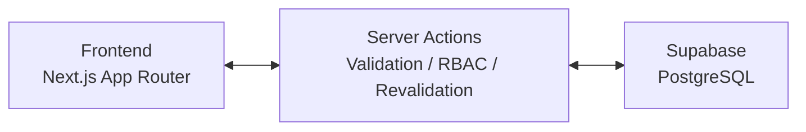

# NexusAdmin - 企業級廠辦營運管理系統

> 基於 Next.js App Router 構建的高性能 ERP MVP，整合物料控存、工單管理與商業智慧（BI）數據視覺化。

<p align="left">
  
  
  
  
  
  
  
</p>

## 專案簡介

NexusAdmin 聚焦製造與廠辦協作場景，將物料管理、工單執行、客戶資料與營運分析整合到同一個操作介面。  
相較於一般展示型後台，這個專案的核心價值不在於「能 CRUD」，而在於把實際業務約束寫進系統邏輯，讓資料一致性、權限邊界與操作可追溯性成為系統的一部分。

## 核心技術棧

- **Frontend**: Next.js App Router, React 19, TypeScript, Tailwind CSS
- **Backend Pattern**: Server Actions, Server Components, Route Protection
- **Data Layer**: Supabase, PostgreSQL
- **Visualization**: Recharts, React Simple Maps
- **Deployment**: Docker, standalone output, on-premise ready image

## 關鍵功能亮點

- **精細權限控管（RBAC）**  
  建立 `admin / manager / operator` 三層權限模型，並以路由保護、側邊導覽過濾、Server Action 驗證與組件級 `RoleGuard` 形成防護鏈，避免只靠前端隱藏按鈕的脆弱實作。

- **生產工單狀態機**  
  工單遵循 `pending -> in_progress -> completed` 與 `pending -> cancelled` 的有限狀態流轉規則，不提供物理刪除，確保現場操作紀錄可被稽核與追溯。

- **物料自動扣料設計**  
  以 BOM 驅動的庫存異動模型為核心，將完工入庫與原料扣減視為同一筆業務事件；資料庫層可透過 Trigger 落實扣料一致性，降低應用層重複計算與併發風險。

- **動態數據戰情室**  
  儀表板直接串接真實資料庫，提供全球客戶分佈地圖、在製工單與庫存價值統計，以及日 / 月 / 年三種維度切換的營收趨勢分析。

- **企業級操作體驗**  
  全域 Toast 通知、按鈕 pending state、防重複提交、統一 modal 視覺語彙與空狀態設計，讓系統在高頻操作下仍維持可預期的互動品質。

## 系統架構簡圖



## 快速啟動

### 1. 安裝依賴

```bash
npm install
```

如果你的環境碰到 peer dependency 衝突，可改用：

```bash
npm install --legacy-peer-deps
```

### 2. 建立環境變數

請建立 `.env.local`，至少包含以下項目：

```bash
NEXT_PUBLIC_SUPABASE_URL=
NEXT_PUBLIC_SUPABASE_ANON_KEY=
SUPABASE_SERVICE_ROLE_KEY=
```

### 3. 啟動開發環境

```bash
npm run dev
```

預設啟動位置：

```text
http://localhost:3000
```

### 4. Docker 地端部署

本專案已支援 `standalone` 輸出與 Multi-stage build，可直接作為企業地端部署（On-Premise）基礎映像：

```bash
docker compose --env-file .env.local up -d --build
```

若你的環境仍使用舊版 CLI，也可以使用：

```bash
docker-compose up -d --build
```

## 商業邏輯思維

### 1. 為什麼工單不能直接刪除？

製造流程的關鍵不是資料乾淨，而是**資料可追溯**。  
若允許直接刪除工單，會破壞生產歷程、責任歸屬與報表可信度，因此系統採用 `cancelled` 狀態保留事件本身，將「撤銷任務」與「抹除紀錄」明確切開。

### 2. 為什麼把權限驗證放進多個層次？

真實 ERP 不應把安全性押在單一入口。  
本專案同時在 Proxy、Layout、Navigation、RoleGuard 與 Server Actions 層處理授權，目的是建立 defense in depth，降低越權操作與 UI/資料不一致的風險。

### 3. 為什麼使用 Server Actions？

這個專案的資料寫入行為大多高度耦合權限、驗證與 revalidation 邏輯。  
透過 Server Actions，可把表單提交、授權判斷、資料寫入與頁面同步更新放在同一條流程內，減少 API surface area，也讓業務規則更集中。

### 4. 為什麼引入 Docker？

對內部系統而言，「能部署在自己機房」往往比「能上雲」更重要。  
Docker 化讓 NexusAdmin 可以更容易落地到企業私有網路、工廠內網或受管控環境，並讓建置與執行環境一致化，降低部署漂移。

### 5. 為什麼把資料一致性下沉到資料庫層？

像 BOM 扣料、完工入庫這類業務事件，本質上屬於交易一致性問題。  
將這類規則設計為資料庫層的原子行為，可以避免前端或應用層因重試、併發或跨頁操作而產生庫存誤差。

## 專案定位

NexusAdmin 不是通用型 CMS，也不是單純的管理後台模板。  
它更接近一個面向製造與營運流程的 ERP MVP：在有限範圍內，優先證明權限模型、狀態機、資料一致性與 BI 視覺化能否被穩定整合，而不是只追求畫面功能數量。
